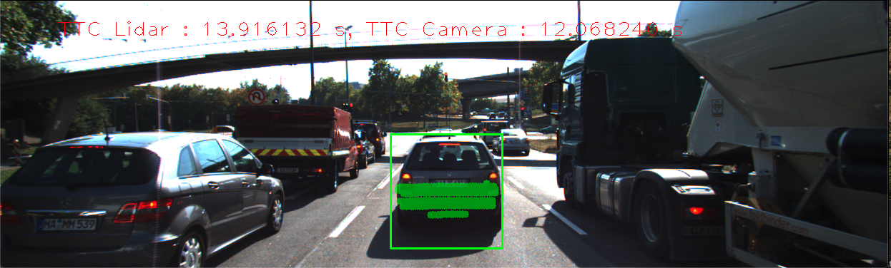
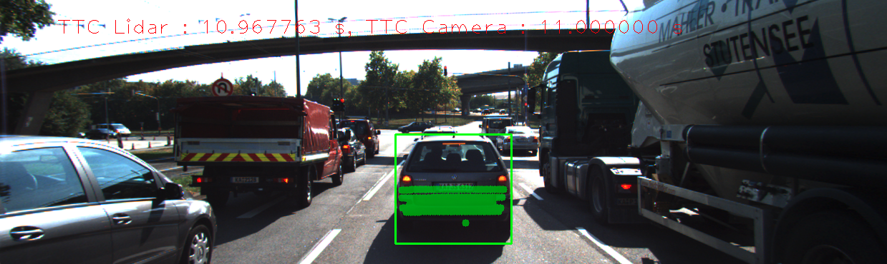
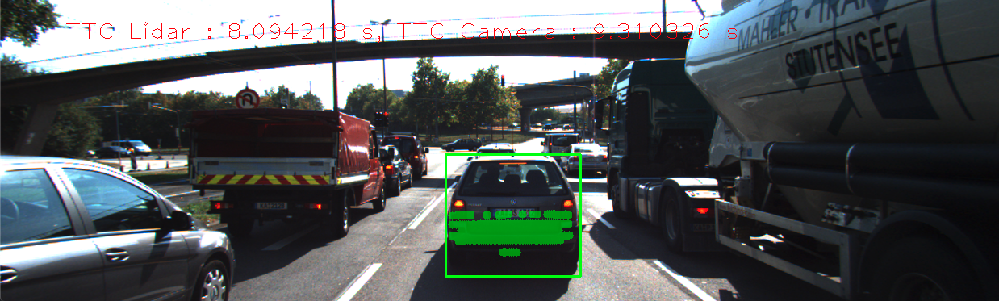

# SFND 3D Object Tracking

Welcome to the final project of the camera course. By completing all the lessons, you now have a solid understanding of keypoint detectors, descriptors, and methods to match them between successive images. Also, you know how to detect objects in an image using the YOLO deep-learning framework. And finally, you know how to associate regions in a camera image with Lidar points in 3D space. Let's take a look at our program schematic to see what we already have accomplished and what's still missing.


In this final project, you will implement the missing parts in the schematic. To do this, you will complete four major tasks: 
1. First, you will develop a way to match 3D objects over time by using keypoint correspondences. 
2. Second, you will compute the TTC based on Lidar measurements. 
3. You will then proceed to do the same using the camera, which requires to first associate keypoint matches to regions of interest and then to compute the TTC based on those matches. 
4. And lastly, you will conduct various tests with the framework. Your goal is to identify the most suitable detector/descriptor combination for TTC estimation and also to search for problems that can lead to faulty measurements by the camera or Lidar sensor. In the last course of this Nanodegree, you will learn about the Kalman filter, which is a great way to combine the two independent TTC measurements into an improved version which is much more reliable than a single sensor alone can be. But before we think about such things, let us focus on your final project in the camera course. 

## Dependencies for Running Locally
* cmake >= 2.8
  * All OSes: [click here for installation instructions](https://cmake.org/install/)
* make >= 4.1 (Linux, Mac), 3.81 (Windows)
  * Linux: make is installed by default on most Linux distros
  * Mac: [install Xcode command line tools to get make](https://developer.apple.com/xcode/features/)
  * Windows: [Click here for installation instructions](http://gnuwin32.sourceforge.net/packages/make.htm)
* Git LFS
  * Weight files are handled using [LFS](https://git-lfs.github.com/)
* OpenCV >= 4.1
  * This must be compiled from source using the `-D OPENCV_ENABLE_NONFREE=ON` cmake flag for testing the SIFT and SURF detectors.
  * The OpenCV 4.1.0 source code can be found [here](https://github.com/opencv/opencv/tree/4.1.0)
* gcc/g++ >= 5.4
  * Linux: gcc / g++ is installed by default on most Linux distros
  * Mac: same deal as make - [install Xcode command line tools](https://developer.apple.com/xcode/features/)
  * Windows: recommend using [MinGW](http://www.mingw.org/)

## Basic Build Instructions

1. Clone this repo.
2. Make a build directory in the top level project directory: `mkdir build && cd build`
3. Compile: `cmake .. && make`
4. Run it: `./3D_object_tracking`.

## Write Up :

# 1. FP.1 Match 3D Objects
In this part, we try to match 3D objects in different frames using Features extractions and matching.
Completed in camFusion_student.cpp.

```cpp
void matchBoundingBoxes(std::vector<cv::DMatch> &matches, std::map<int, int> &bbBestMatches, DataFrame &prevFrame, DataFrame &currFrame)
{   
    // NOTE: After calling a cv::DescriptorMatcher::match function, each DMatch
    // contains two keypoint indices, queryIdx and trainIdx, based on the order of image arguments to match.
    // https://docs.opencv.org/4.1.0/db/d39/classcv_1_1DescriptorMatcher.html#a0f046f47b68ec7074391e1e85c750cba
    // prevFrame.keypoints is indexed by queryIdx
    // currFrame.keypoints is indexed by trainIdx

    int p = prevFrame.boundingBoxes.size();
    int c = currFrame.boundingBoxes.size();
    int pt_counts[p][c];


    for(auto it = matches.begin(); it<matches.end(); it++){
        cv::KeyPoint query = prevFrame.keypoints[it->queryIdx];
        auto query_pt = cv::Point(query.pt.x, query.pt.y);
        bool query_found = false;

        cv::KeyPoint train = currFrame.keypoints[it->trainIdx];
        auto train_pt = cv::Point(train.pt.x, train.pt.y);
        bool train_found = false;

        std::vector<int> query_id, train_id;
        for (int i = 0; i < p; i++) 
        {
            if (prevFrame.boundingBoxes[i].roi.contains(query_pt))            
             {
                query_found = true;
                query_id.push_back(i);
             }
             else{
                 continue;
             }
        }
        for (int i = 0; i < c; i++) 
        {
            if (currFrame.boundingBoxes[i].roi.contains(train_pt))            
            {
                train_found= true;
                train_id.push_back(i);
            }
            else{
                 continue;
             }
        }

        if (query_found && train_found) 
        {
            for (auto id_prev: query_id)
                for (auto id_curr: train_id)
                     pt_counts[id_prev][id_curr] += 1;
        }

    }
//Getting bounding boxes with maximum number of keypoints between previous and current frames.
     for (int i = 0; i < p; i++)
    {  
         int max_count = 0;
         int id_max = 0;
         for (int j = 0; j < c; j++)
             if (pt_counts[i][j] > max_count)
             {  
                  max_count = pt_counts[i][j];
                  id_max = j;
             }
          //bbBestMatches[i] = id_max;
          bbBestMatches.insert({i,id_max}); //Associating previous bounding box with current bounding box having max number of correspondances.
    } 
}
```


# 2. FP.2 Compute Lidar-based TTC
In this part we compute time-to-collision for all matched 3D objects using only Lidar measurements from the matched bounding boxes between current and previous frame.

```cpp
void computeTTCLidar(std::vector<LidarPoint> &lidarPointsPrev,
                     std::vector<LidarPoint> &lidarPointsCurr, double frameRate, double &TTC)
{
    double dT = 0.1;        // time between two measurements in seconds
    constexpr double laneWidth = 4.0; // assumed width of the ego lane

    // find closest distance to Lidar points within ego lane
    double minXPrev = 1e9, minXCurr = 1e9;
    if(lidarPointsPrev.size()){
    for (auto it = lidarPointsPrev.begin(); it != lidarPointsPrev.end(); ++it)
    {   if(-laneWidth/2 <=(it->y) && (it->y)<=laneWidth/2){
        minXPrev = minXPrev > it->x ? it->x : minXPrev;
    }
    }
    }

    if(lidarPointsCurr.size()){
    for (auto it = lidarPointsCurr.begin(); it != lidarPointsCurr.end(); ++it)
    {    if(-laneWidth/2 <=(it->y) && (it->y)<=laneWidth/2){
        minXCurr = minXCurr > it->x ? it->x : minXCurr;
    }
    }
    }

    if (minXCurr>minXPrev){ //If the speed of the vehicle in front is greater than the preceeding vehicle can nver collide with it.
        TTC = INT_FAST16_MAX;
        return;
    }
    // compute TTC from both measurements
    TTC = minXCurr * dT / (minXPrev - minXCurr);
}
```
We do this by computing mean X distance between ego car and preceding vehicles in the current and previous frame, then we use the math equations shown below. Completed in camFusion_student.cpp.

# 3. FP.3 Associate Keypoint Correspondences with Bounding Boxes
In this part we Prepare the TTC computation based on camera measurements by associating keypoint correspondences to the bounding boxes which enclose them. Completed in camFusion_student.cpp.

```cpp
template <class T> //Template class to return bounding box roi.x for prev and current frames
T box_x (const double &shrinkfactor, double roi_x, double boundingbox_w) {
 return roi_x + shrinkfactor*boundingbox_w / 2.0;
};

template <class T> //Template class to return bounding box roi.y for prev and current frames
T box_y (const double &shrinkfactor, double roi_y, double boundingbox_h) {
 return roi_y + shrinkfactor*boundingbox_h/ 2.0;
};

template <class T> //Template class to return bounding box roi.width for prev and current frames
T box_width (const double &shrinkfactor, double roi_width) {
 return roi_width * (1-shrinkfactor);
};

template <class T> //Template class to return bounding box roi.height for prev and current frames
T box_height (const double &shrinkfactor, double roi_height) {
 return roi_height * (1-shrinkfactor);
};

void clusterKptMatchesWithROI(BoundingBox &boundingBox, std::vector<cv::KeyPoint> &kptsPrev, std::vector<cv::KeyPoint> &kptsCurr, std::vector<cv::DMatch> &kptMatches)
{


        cv::KeyPoint tempCurrKp, tempPrevKp;
        vector<cv::DMatch> mtchsBB;
        vector<double>eucliadianDis;

        const double shrinkFactor = 0.10;
        //vector<vector<BoundingBox>::iterator> enclosingBoxes; // pointers to all bounding boxes which enclose the current Lidar point
     
            // shrink current bounding box slightly to avoid having too many outlier points around the edges
            cv::Rect smallerBox;
            smallerBox.x = box_x<double>(shrinkFactor, boundingBox.roi.x, boundingBox.roi.width);
            smallerBox.y = box_y<double>(shrinkFactor, boundingBox.roi.y, boundingBox.roi.height);
            smallerBox.width = box_width <double>(shrinkFactor, boundingBox.roi.width) ;
            smallerBox.height = box_height <double>( shrinkFactor, boundingBox.roi.height);


            // check wether point is within current bounding box
     
         // eof loop over all bounding boxes

    for (auto it = kptMatches.begin(); it!=kptMatches.end(); ++it)
    {
        tempCurrKp = kptsCurr[(*it).trainIdx];
        tempPrevKp = kptsPrev[(*it).queryIdx];

        if(smallerBox.contains(tempCurrKp.pt) && smallerBox.contains(tempPrevKp .pt))
        {
            mtchsBB.push_back((*it));
            eucliadianDis.push_back(cv::norm(tempCurrKp.pt-tempPrevKp.pt));
        }
    }

    double mean = std::accumulate(eucliadianDis.begin(), eucliadianDis.end(), 0.0) / eucliadianDis.size();
    double distTh = 1.5 * mean;

    // associate best matches to given BB
    auto it1= mtchsBB.begin();
    for (auto it2 = eucliadianDis.begin(); it2!=eucliadianDis.end(); ++it2,++it1)
    {
        //cout<<"dist= "<<(*it).distance<<endl;
        if((*it2) <  distTh  )
        {
            tempCurrKp = kptsCurr[(*it1).trainIdx];
            boundingBox.kptMatches.push_back((*it1));
            boundingBox.keypoints.push_back(tempCurrKp);
        }
    }

    
}
```

# 4. FP.4 Compute Camera-based TTC
In this part we Compute the time-to-collision in second for all matched 3D objects using only keypoint correspondences from the matched bounding boxes between current and previous frame.

in camFusuin_Student.cpp

```cpp
void computeTTCCamera(std::vector<cv::KeyPoint> &kptsPrev, std::vector<cv::KeyPoint> &kptsCurr, 
                      std::vector<cv::DMatch> kptMatches, double frameRate, double &TTC, cv::Mat *visImg)
{
    // compute distance ratios between all matched keypoints
    vector<double> distRatios; // stores the distance ratios for all keypoints between curr. and prev. frame
    for (auto it1 = kptMatches.begin(); it1 != kptMatches.end() - 1; ++it1)
    { // outer kpt. loop
       // std::cout<<it1->trainIdx<<std::endl;
        // get current keypoint and its matched partner in the prev. frame
        cv::KeyPoint kpOuterCurr = kptsCurr.at(it1->trainIdx);
        cv::KeyPoint kpOuterPrev = kptsPrev.at(it1->queryIdx);

        for (auto it2 = kptMatches.begin() + 1; it2 != kptMatches.end(); ++it2)
        { // inner kpt.-loop

            double minDist = 100.0; // min. required distance

            // get next keypoint and its matched partner in the prev. frame
            cv::KeyPoint kpInnerCurr = kptsCurr.at(it2->trainIdx);
            cv::KeyPoint kpInnerPrev = kptsPrev.at(it2->queryIdx);

            // compute distances and distance ratios
            double distCurr = cv::norm(kpOuterCurr.pt - kpInnerCurr.pt);
            //std::cout<<kpOuterCurr.pt<<std::endl;
            double distPrev = cv::norm(kpOuterPrev.pt - kpInnerPrev.pt);

            if (distPrev > std::numeric_limits<double>::epsilon() && distCurr >= minDist)
            { // avoid division by zero

                double distRatio = distCurr / distPrev;
                distRatios.push_back(distRatio);
            }
        } // eof inner loop over all matched kpts
    }     // eof outer loop over all matched kpts

    // only continue if list of distance ratios is not empty
    if (distRatios.size() == 0)
    {
        TTC = NAN;
        return;
    }

    // compute camera-based TTC from distance ratios
    //double meanDistRatio = std::accumulate(distRatios.begin(), distRatios.end(), 0.0) / distRatios.size();
    //double median{0};
    size_t sz = distRatios.size();
    std::sort(distRatios.begin(), distRatios.end());
    double median = sz%2==0? distRatios[distRatios.size() / 2]: 0.5 * (distRatios[distRatios.size() / 2 - 1] + distRatios[distRatios.size() / 2]);
    double dT = 1 / frameRate;
    TTC = -dT / (1 - median);

    // STUDENT TASK (replacement for meanDistRatio)
}
```

# 5. FP.5 Performance Evaluation 1
TTC from Lidar is not always correct because of some outliers and some unstable points from preceding vehicle's front mirrors, those need to be filtered out.

Example of errors in Lidar TTC shown below, where first TTC was ~13 s, and it decreased to ~10.9 s then decreased to ~8.09 s. The error between Lidar TTC and Camera TTC decreases from 1.84s to 0.04s and then increases to 1.22s





# 6. FP.6 Performance Evaluation 2
From the previous project(https://github.com/gautam-sharma1/SensorFusion/tree/master/SFND_2D_Feature_Tracking) top 3 detector/descriptor has been seletected in terms of their performance on accuracy and speed.

Like Lidar, TTC from camera is not always correct as when get a robust clusterKptMatchesWithROI can get a stable TTC from Camera. If the result get unstable, It's probably the worse keypints matches.

Following are the results of running every detector-decriptor combination

Detector Descriptor TTC Camera TTC Lidar Error
SHITOMASI BRISK 12.0602 13.9161 -1.85592
SHITOMASI BRIEF 12.5261 13.9161 -1.39
SHITOMASI ORB 12.5648 13.9161 -1.3513
SHITOMASI ORB 10.6905 8.09422 2.59632
SHITOMASI FREAK nan 13.9161 nan
HARRIS BRISK 17.6569 13.9161 3.74073
HARRIS BRISK 12.0386 3.17535 8.86327
HARRIS BRIEF 16.1445 13.9161 2.22839
HARRIS BRIEF 9.43937 8.09422 1.34515
HARRIS ORB 17.6569 13.9161 3.74073
HARRIS ORB -inf 10.9678 -inf
HARRIS FREAK nan 13.9161 nan
HARRIS FREAK nan 10.9678 nan
FAST BRISK 12.2331 13.9161 -1.68303
FAST BRIEF 15.8808 13.9161 1.96463
FAST ORB 14.1981 13.9161 0.281955
FAST FREAK 0.247457 13.9161 -13.6687
BRISK BRISK 13.6926 13.9161 -0.223558
BRISK BRIEF 20.3133 13.9161 6.39715
BRISK ORB 18.5041 13.9161 4.58799
BRISK FREAK 1.26439 13.9161 -12.6517
ORB BRISK 34.0111 13.9161 20.095
ORB BRISK 11.1552 8.09422 3.06102
ORB BRIEF 28.3463 13.9161 14.4301
ORB BRIEF 21.0849 10.9678 10.1171
ORB BRIEF 15.6066 3.17535 12.4313
ORB ORB 28.2302 13.9161 14.3141
ORB ORB 11.3457 10.9678 0.3779
ORB FREAK -inf 13.9161 -inf
ORB FREAK -inf 10.9678 -inf
ORB FREAK 10.4631 3.17535 7.28775

It can be seen from the last image that Camera TTC is 9.31 whereas Lidar TTC 8.09. It can be observed that even a error of 1.31 seconds is enough to cause an accident.

Top 3 combinations are FAST-BRIEF, FAST-ORB, HARRIS-BRIEF.
